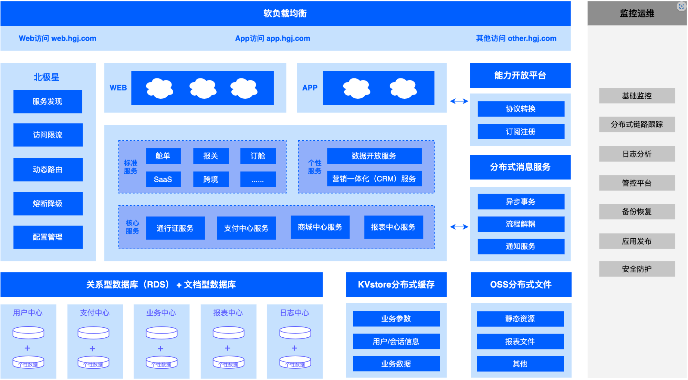
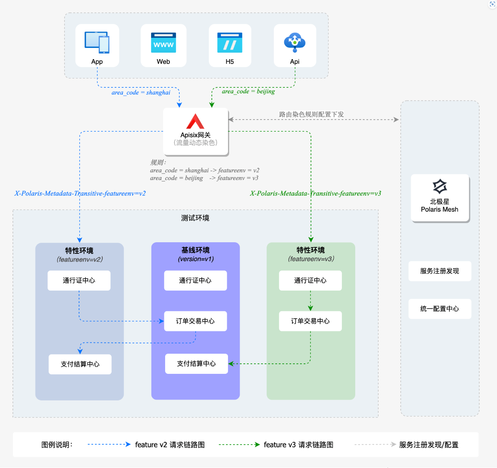
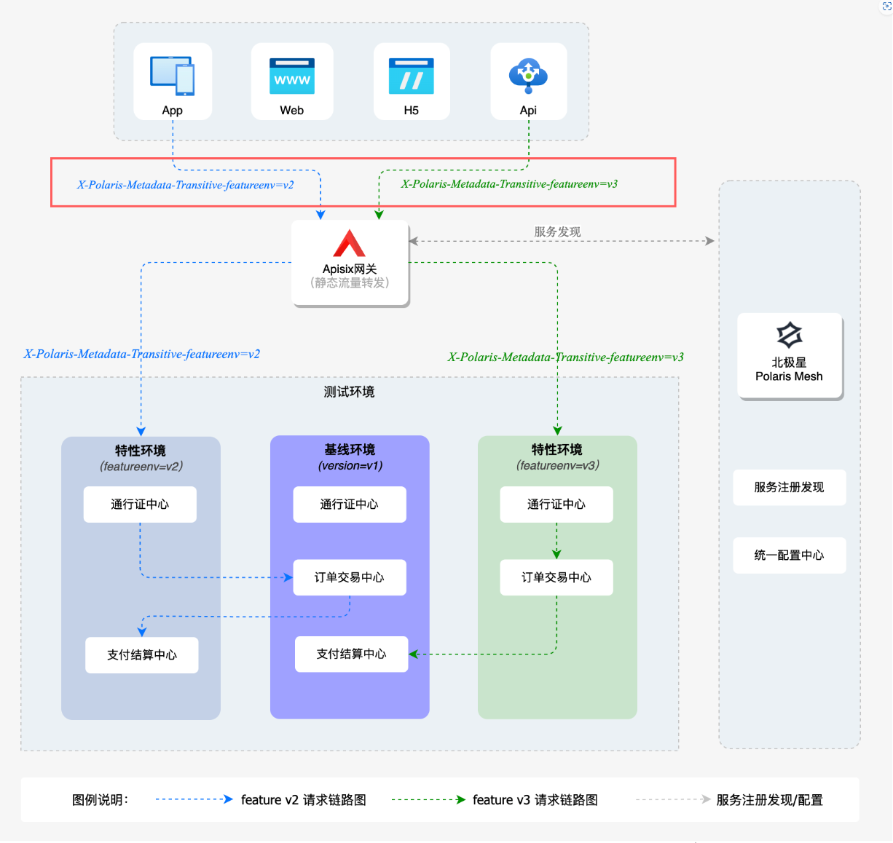
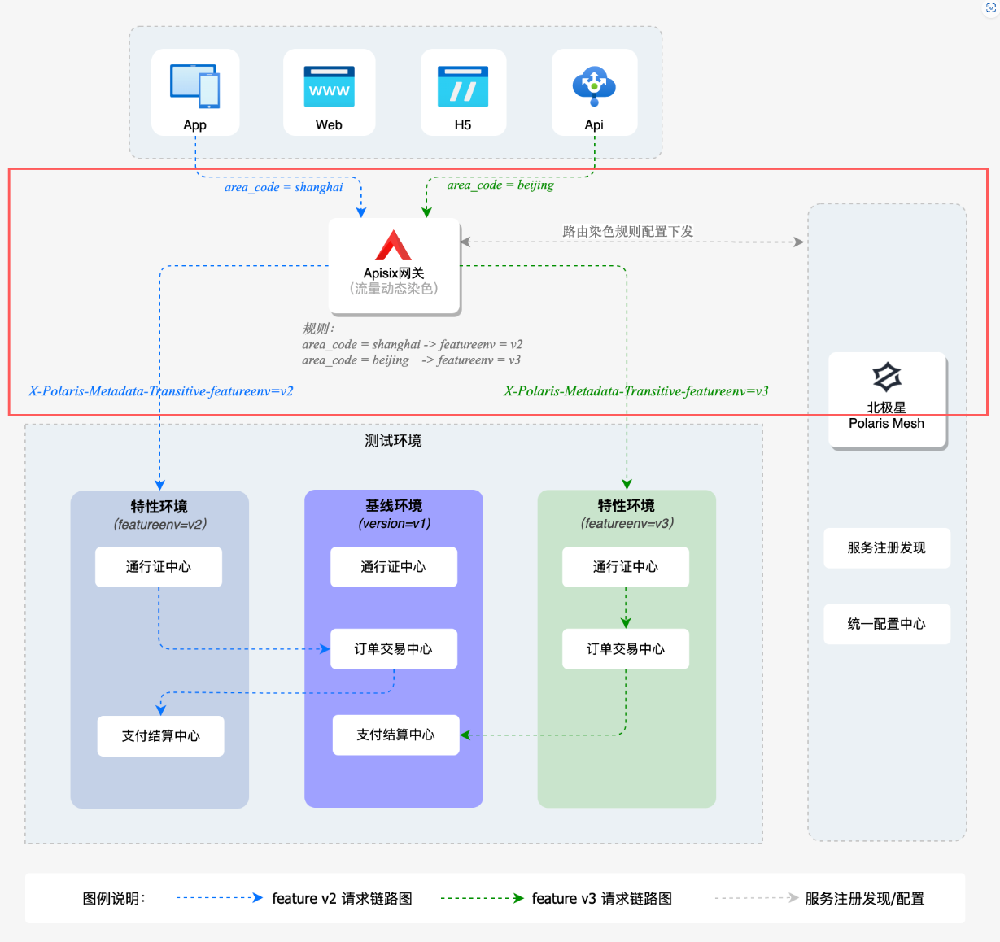

总部位于苏州的这家国际物流SaaS公司，已经借助云原生能力，实现了技术架构的全面升级。
海管家，这家创立于2015年的年轻科技公司，不到8年时间，将服务的客户数量做到超百万级，遍布全球各地，成长速度让人咂舌。
得益于公司在AI、大数据、云计算等技术领域的超前布局，海管家率先在物流领域推出多个变革性产品，为港口、船公司、货代企业、船代企业提供领先的系统解决方案和数据对接服务，在无纸化码头系统领域有丰富的项目经验。
目前，海管家的产品矩阵涵盖了可视化、电子单证发送、SaaS货代操作系统、跨境业务系统、获客和IM工具为主的综合性SaaS服务，并提供在线报关、线上代订舱（E-BOOKING）等公共物流服务。
那么，海管家又是如何通过云原生，在物流 SaaS领域实现业务创新，为客户提供更加稳定、可靠的服务的，并进一步帮助企业优化资源和人力成本的呢？带着这些疑问，我们深入带你了解这家企业的技术变革历程。

## 业务增长太快，研发效能如何解决？

随着海管家 SaaS 业务的上线，注册认证用户呈现出了爆发式的增长，用户的使用场景也不断扩大。在这个过程中，SaaS 的用户使用体验变得愈发重要，如何在用户规模高速增长的同时可以保证 SaaS 的稳定性、敏捷性， SaaS 的微服务开发效率如何保证，这些都给研发团队带来了一定的挑战。

#### 挑战一，业务迭代实效变慢、开发效率变低

最大的挑战之一，来自于SaaS用户场景需求的增加，越来越多的功能等待发开、发布上线，对迭代频率的要求越来越高，但由于 SaaS 服务技术架构偏向于传统的应用开发方式，不能够像微服务、模块化架构一样，进行多线并行开发。同时，对于应用发布，缺少灰度发布能力，为了保障业务稳定性，每次发布客户只能选择在凌晨的业务低峰期进行，开发、运维、测试同学苦不堪言，对于发版无损发布能力的需求声音越来越大。

#### 挑战二、业务架构与技术架构能力不匹配

还有一个，疫情物流承压、货代数字化成大趋势，但数字化如何在国际物流落地，海管家提出了自己的标准。
“国际物流跨境角色多、链条长，一个提供国际货代服务的 SaaS 公司如果要做数字化，一条产品线至少要提升20%到30%的效能，才可实现商业的快速复制、扩张以及落地，进而才能发展为 SaaS 公司的核心业务线。“海管家CEO金忠国表示。
而且除了效能问题，国际货代的SaaS服务的本质其实是要解决信息、数据和相关业务的标准化问题，而这些需要行业各相关角色的协同，单个公司靠自己无法解决标准化问题。
作为一家 SaaS 服务商，海管家选择的发展路径是跟着行业节奏逐点击破、连点成线，最终达到平台的融合。
可以预计，未来国际物流SaaS平台企业一定会以『数据服务化』、『全渠道服务化』和『新业务拓展敏捷化』的交融与创新为发展方向，这对团队的业务架构能力与技术架构能力提出来比较高的要求。

此外，在市场需求的快速变化下，产品功能创新和迭代效率问题也是对技术架构的一大挑战。

## “我们是国内第一批云住民”

”我们从创业的一开始就基于云原生，可以说是国内第一批云住民，上云用云就和血液一样，云造就了我们，也发展了我们。”海管家技术负责人徐红维告诉鹅厂技术派。
云原生，它是先进软件架构技术和管理方法的思想集合，通过容器、微服务、持续交付等一系列技术，实现了信息系统由烟囱状、重装置和低效率的架构向分布式、小型化和自动化的新一代软件架构的转变。
同时，云原生架构具备松耦合、分布式、高韧性三大特点，能够以业务应用为中心，充分利用云计算优势，实现敏捷交付、价值聚焦的核心目标。
“有没有发现，上述问题及现状的解法和云原生架构带来的核心能力不谋而合。”
“因此，海管家很早就笃定要将主要的业务应用，包括前端 Web 容器、网关、后端微服务、大数据等等通过 Kubernetes 集群部署，以云原生的方式帮助业务快速迭代，灵活响应商业需求。”徐红维补充道。

## 微服务虽好，可不要“贪杯”哦

#### 微服务治理平台怎么选

都在说微服务，但是微服务也要对症下药。对于微服务的治理、改造，海管家的团队更加看重的是改造的复杂度、侵入性、稳定性等方面，海管家技术团队对目前市面上的几款开源产品进行调研以及和相关团队进行深入的沟通。
经过大量的预研后，最终选择了腾讯云北极星（Polaris Mesh），主要看重一下几个特性：强大的控制面、无侵入、稳定性高、丰富的可观测能力、混合云支持、兼容Kubernetes等。
基于北极星（Polaris Mesh）的服务管理、流量管理、故障容错、配置管理和可观测性五大功能，以及容器服务的基础运行能力，海管家重新架构了业务的技术架构如下图。

#### 微服务开发框架选型，开放性、成熟度、普适性缺一不可

与容器化改造几乎同步进行的是对微服务架构的统一。
在此之前，海管家的各个业务单元多种技术栈并存，彼此之间相互通讯复杂度高，项目成员的交接往往要耗费巨大的精力，极大程度上阻碍了业务发展的进展，因此微服务架构统一势在必行。
海管家经历了 2 年多时间完成了这一项艰巨的工作，虽然投入精力巨大，但收益很大，在技术框架上都有统一的标准可以遵循，各团队之间统一技术栈，研发效率成倍提升。
关系到未来多年的技术战略，在微服务架构的选型上，开放性、成熟度、普适性标准缺一不可，考虑到海管家以 Java 为主要开发语言，Spring Cloud Tencent 就成为了微服务框架的新的选择。同时，海管家也将自研的基于Spring Cloud + Dubbo开发标准的基础服务框架与Spring Cloud Tencent、Polaris Mesh进行兼容整合。

#### 老项目与新架构之间如何平滑演进

架构的变更需要有一个演进过程。云原生其实源自于PaaS，所以在应用云原生架构的时候，在PaaS层也遇到了平滑演进的问题。如何让产品和开发者即能保留以前的习惯，同时又能去尝试新的交付、开发方式？在传统的模式中，大家习惯于交付代码包，习惯于基于虚拟机的运维，而云原生时代以容器镜像作为交付载体，而运行实例则是镜像实例化容器。
无论是基于传统架构的PaaS，还是基于kubernetes的PaaS，实现主要操作都是一样的，包括：建站、发布、重启、扩容/缩容、下线等等，实现两套无疑非常浪费资源，也增加了维护成本，对于产品和开发者来说干的事情是一样的。所以海管家技术团队用kubernetes实现了所有公共部分，包括：统一元数据、统一运维操作、统一资源抽象。在产品层和运维方式上，提供两种控制面。
在进行技术架构演技的过程中，会面临新老系统并存的问题，老（遗留）系统的架构技术栈老旧，改造、重构成本较大，海管家通过Mesh的方式统一解决这个问题。新系统，Mesh是Pod里的Sidecar，但老系统因为一般情况下是没有运行在kubernetes上，所以不支持Pod和Sidecar的运维模式，需要用Java Agent的模式来管理Mesh进程，使得Mesh能够帮助老架构下的应用完成服务化改造，并支持新老架构下服务的统一管理。

海管家 SaaS 研发团队意识到，随着业务发展的向好，这些挑战也会也越来越大。
在业务快速发展中，既要保证好已有业务的稳定性，又要快速地迭代新功能，并且需要保证开发的效率并不会随着业务增长而大幅降低。在新的微服务体系下，海管家的业务开发人员更加专注在业务本身，从繁杂的技术栈中脱离出来，也就能解决两大关键性的问题：系统稳定性、研发效率。

## ”移动互联网时代，谁还玩停机维护那一套“

以下是我们在微服务探索过程中的一些经验分享，希望能够帮到正在阅读本文的同行。

#### 第一，环境隔离

在实际的开发过程中，一个微服务架构系统下的不同微服务可能是由多个团队进行开发与维护的，每个团队只需关注所属的一个或多个微服务，而各个团队维护的微服务之间可能存在相互调用关系。
如果一个团队在开发其所属的微服务，调试的时候需要验证完整的微服务调用链路，此时需要依赖其他团队的微服务，如何部署开发联调环境就会遇到以下问题：
首先，如果所有团队都使用同一套开发联调环境，那么一个团队的测试微服务实例无法正常运行时，会影响其他依赖该微服务的应用也无法正常运行。
其次，如果每个团队有单独的一套开发联调环境，那么每个团队不仅需要维护自己环境的微服务应用，还需要维护其他团队环境的自身所属微服务应用，效率大大降低。同时，每个团队都需要部署完整的一套微服务架构应用，成本也随着团队数的增加而大大上升。
此时，可以使用测试环境路由的架构来帮助部署一套运维简单且成本较低开发联调环境。测试环境路由是一种基于服务路由的环境治理策略，核心是维护一个稳定的基线环境作为基础环境，测试环境仅需要部署需要变更的微服务。多测试环境有两个基础概念，如下所示：

1.**基线环境（Baseline Environment）**: 完整稳定的基础环境，是作为同类型下其他环境流量通路的一个兜底可用环境，用户应该尽量保证基线环境的完整性、稳定性。

2.**测试环境（Feature Environment）**: 一种临时环境，仅可能为开发/测试环境类型，测试环境不需要部署全链路完整的服务，而是仅部署本次有变更的服务，其他服务通过服务路由的方式复用基线环境服务资源。

部署完成多测试环境后，开发者可以通过一定的路由规则方式，将测试请求打到不同的测试环境，如果测试环境没有相应的微服务处理链路上的请求，那么会降级到基线环境处理。因此，开发者需要将开发新测试的微服务部署到对应的测试环境，而不需要更新或不属于开发者管理的微服务则复用基线环境的服务，完成对应测试环境的测试。
虽然测试环境路由是一个相对成熟的开发测试环境解决方案，但是能够开箱即用的生产开发框架却不多，往往需要开发者二次开发相应的功能。因此需要一个相对完善的解决方案来帮助实现测试环境路由，简化开发难度并提升开发效率。
基于上述的想法，海管家有十几条产品线，并且产品线之间存在着错综复杂的关联，并线开发、联调等问题一直被产研团队吐槽和诟病。
基于北极星微服务引擎的能力，结合Spring Cloud Tencent 的开发框架，与社区进行合作开发以下的方案，测试环境路由的样例实现以下图为例，一共有两个测试环境以及一个基线环境。流量从端到端会依次经过以下组件：**App（前端） -> 网关 -> 通行证中心 -> 订单交易中心 -> 支付结算中心**。

为了达到测试环境路由的能力，开发工作需要做三件事情：

1. 服务实例染色（标识实例属于哪个测试环境）
2. 流量染色（标识请求应该被转发到哪个测试环境）
3. 服务路由
   - 网关根据请求的目标测试环境标签转发到对应的目标测试环境的用户中心。
   - 服务调用时，优先转发到同测试环境下的目标服务实例，如果同测试环境下没有服务实例则转发到基线环境。

其中在流量染色的环节，海管家结合着Spring Cloud Tencent的开发组件的能力，使用客户端染色 + 网关动态染色。

**客户端染色 （推荐）**

如下图所示，在客户端发出的 HTTP 请求里，新增 X-Polaris-Metadata-Transitive-featureenv=v2 请求头即可实现染色。该方式是让开发者在请求创建的时候根据业务逻辑进行流量染色。
      

**网关动态染色（推荐）**
动态染色是开发者配置一定的染色规则，让流量经过网关时自动染色，使用起来相当方便。例如把区域编号 area_code=shanghai 用户的请求都转发到 feature env v2 环境，把区域编号 area_code=beijing 的用户的请求都转发到  feature env v3 环境。只需要配置一条染色规则即可实现。
         

####  第二，灰度发布

随着业务的发展、客户需求的增多、行业应用场景的多样化，产线平均每天几十次发布。为了不影响白天业务高峰以及用户群体的特殊性（面对B端的SaaS系统），每次较大发版只能选择在凌晨业务低峰期进行。
想象一下，如果产品、研发、运维人员、中台支持人员每次都集中在晚上发布，太不人性化。“移动互联网的时代，谁还玩停机维护那一套呢？”
如果晚上选择较少的人参与发布，那么当出问题的时候会『耽误救治』的最佳时机，故障责任也不好划分。
北极星，在灰度发布这方面提供了很大的支持和帮助，能够满足海管家现阶段灰度发布的场景：首先用户体验不能中断的业务，其次微服务业务的存在关联关系的多个微服务的特性变更。
可以基于域名分离的方式实现全链路灰度，通过不同的域名区分灰度环境和稳定环境。前端客户的请求通过灰度域名访问到灰度版本的服务，通过稳定域名访问到稳定版本的服务。 

灰度请求通过灰度域名接入到网关，网关通过域名识别到灰度请求后，将请求优先路由到灰度版本的服务，并通过请求头的方式进行灰度染色。后续微服务之间，服务框架通过请求头识别到灰度请求，会优先将请求路由到灰度版本服务，如果寻址不到灰度版本，则路由到稳定版本服务。
对于全链路灰度发布，海管家不仅需要将流量进行灰度，还需要将后端的数据库、缓存、消息队列等等基础服务也支持灰度，这里还需要跟北极星社区进行更加深度的合作和开发。

## 看的远，才能走的稳

“看的远，才能走的稳。看得远映射到平台化，走的稳映射到系统重构，这已然成为海管家的重要技术战略。”金忠国说。
“未来，我们将继续进行云原生架构升级探索，持续提高SaaS业务系统的稳定性和敏捷性，随着对云原生架构的理解的深入，我们将继续与腾讯云原生团队进一步的探索和研究，给客户创造更多的价值。”

