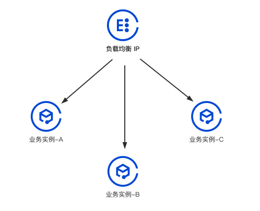

## 导语

PolarisMesh 是腾讯开源的百万级服务发现和治理中心，积累了腾讯从虚拟机到容器时代的分布式服务治理经验。作为分布式和微服务架构中的核心组件，PolarisMesh 提供服务寻址、流量调度、故障容错和访问控制等一系列能力，在K8s 和虚拟机环境中可以无差别使用，支持主流的开发模式，兼容grpc、spring cloud和servicemesh等开源生态，帮助用户快速构建扩展性强、可用性高的业务架构，实现从传统架构到云原生架构的转型。

## 内网寻址存在的问题

当某个服务下部署了多个应用程序副本时，一个请求如何发送给某一副本上进行处理呢？当应用部署于kubernetes时，请求流量先经过Service，再由Service将流量转发至某一个Pod进行处理；而应用部署在VM或者物理机时，会额外部署一个用于流量转发的组件，请求将先经过该组件，再由该组件将流量转发至某一台机器进行请求处理。

上述请求调用的方式，都是将所有的流量通过LVS等四层负载均衡组件进行转发，即某个服务下的所有服务实例都挂载到一个VIP（Virtual IP）下，所有的请求都先经过此VIP，再由VIP转发，但是这种方式使用起来会遇到以下几个明显的问题：

- **负载问题**：所有的请求都必须经过这个VIP，VIP的请求转发压力会增大，容易引起四层负载组件出现高负载。
- **性能问题**：请求链路中增加了负载均衡组件到业务进程的一跳，使得长尾时延变大；比如filebeat上报ES，ES集群暴露一个VIP，当filebeat上报数据时，由于每个请求都是大数据包并且均经过VIP，导致长尾时延很大。
- **成本问题**：需要维护VIP的可用性以及高性能，成本变大；直接在云上购买VIP产品，产品规格为50Mpbs的话，每月的成本都在¥3000～¥4000左右。

如果要解决VIP所带来的问题，那么通用的解决方式，就是去除负载均衡组件到业务进程这一跳的网络请求链路，直接将主调方的请求流量发送至对应业务进程进行处理。这种思路存在两种解决方案。

- **侵入式方案**：主动获取被调方地址。主调方发起请求前先通过SDK的形式，发起请求前需调用SDK的获取服务地址的方法，在获取某服务下业务进程的的IP地址信息后向被调方发起请求。该方案需要将服务发现SDK与业务框架进行集成。
- **无侵入式方案**：被动获取被调方地址。该方案最典型的就是DNS协议。主调方仅需要记录被调方的域名信息，通过DNS的形式，获取域名下的所有服务地址信息，随机选取一个向被调方发起请求。该方案无需将服务发现SDK与业务框架进行集成。

在上文提到的filebeat上报ES、组件Proxy统一接入地址、数据库主备节点统一接入地址等几个场景中，由于涉及到开源及第三方组件，这些组件无法通过改造的方式集成注册中心SDK，因此无法实施侵入式方案，只能通过无侵入式的方案来解决，下面我们看看如何实现无侵入的内网DNS方案。

## 如何实现无侵入的内网DNS

上述所提到的内网DNS方案，主要有集中式和分布式两种实现方式，北极星对这两种方式均提供支持。下面向大家分享在前期北极星对于这两种方案的设计思考。

### 集中式DNS

集中式DNS模式，需要北极星服务端实现DNS协议，然后需要修改业务进程所在环境的/etc/resolv.conf 配置，将北极星服务端所在IP作为第一个 nameserver 地址即可，这样业务进程所有的DNS请求都将发往北极星服务端，北极星服务端会根据域名解析出对应的服务以及命名空间，将相关实例地址信息数据进行DNS回包。

可见，在时间驱动型场景中，相比执行内容而言，业务更关注的任务是定时执行还是周期执行、执行具体时间点准确性、周期频率的长短等时间因素。

### 分布式DNS

分布式DNS模式，则是通过在业务进程所在环境运行 polaris-sidecar 进程，然后需要修改业务进程所在环境的/etc/resolv.conf 配置，将 127.0.0.1 所在IP作为第一个 nameserver 地址，这样业务的DNS请求将全部由polaris-sidecar进程代为处理，polaris-sidecar在将自身缓存的服务地址列表进行DNS回包。polaris-sidecar 自身的服务地址信息缓存会定时和北极星服务端进行同步，从而拉取服务的最新实例地址列表。

## 北极星的选择：分布式DNS

这里再给出一个北极星对于集中式DNS与分布式DNS，在能力支持上的对比表格：

| 功能     | 集中DNS | 分布式DNS |
| :------- | :------ | :-------- |
| 服务发现 | 支持    | 支持      |
| 服务注册 | 不支持  | 不支持    |
| 标签路由 | 不支持  | 支持      |
| 就近路由 | 不支持  | 支持      |
| 故障熔断 | 支持    | 支持      |
| 限流     | 不支持  | 部分支持  |
| 鉴权     | 不支持  | 支持      |

- **集中式DNS**：DNS请求只能携带域名名称信息，提供的数据信息非常有限，北极星在此基础上只能做到服务发现，无法满足用户就近路由、分区路由等服务治理的需求。

- **分布式DNS**：由于 polaris-sidecar 与业务进程在同一部署环境下，因此可以将一些静态信息注入为环境变量，polaris-sidecar 会将这些环境变量信息作为服务治理所需要的数据，每次处理DNS请求时可以通过这些静态标签执行相应的服务治理流程；因此相比集中式DNS服务发现，分布式DNS方案可以享受到更多的北极星服务治理能力。

- **选型依据**：北极星服务端插件化的设计，要支持集中式DNS的方案十分便捷，仅需要在北极星服务端接入层中添加一个DNS协议的接入插件即可。但是北极星定位是一个服务治理中心，因此北极星在支持DNS协议的服务发现基础之上，同时还希望能将治理能力带入到DNS协议中，因此，最终北极星采用分布式DNS方案实现内网DNS寻址的能力。

## 后续规划

- 协议扩展：支持SRV记录，解决后端多个实例端口号不一致的问题。
- 能力补齐：支持限流及鉴权能力。
