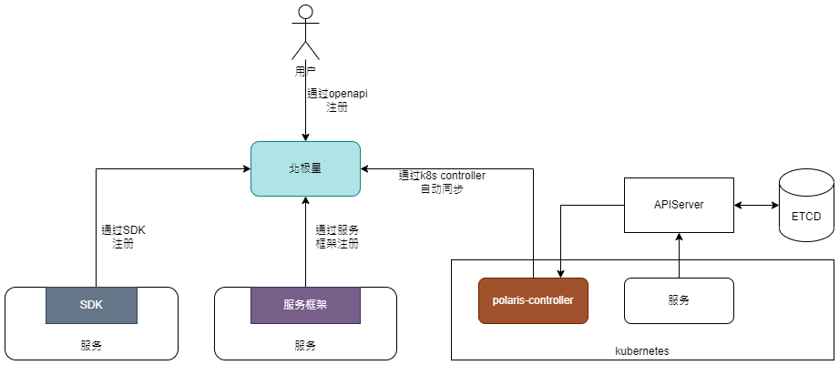

## 定义

服务发现指的主调方是根据服务名标识，拉取服务实例列表，以供后续进行服务调用的操作。

## 服务发现的方式

北极星支持以下4种方式进行服务发现：

### 通过SDK进行服务发现

北极星提供了多语言SDK，SDK通过ConsumerAPI提供3个接口进行服务发现：

- getAllInstances：获取服务下全量的服务实例列表，不做任何过滤。
- getHealthyInstances：获取服务下健康的服务实例列表，只包含健康实例，不包含被熔断、不健康、隔离、权重为0的实例。
- getOneInstances：针对健康的服务实例列表，进行动态路由和负载均衡，返回单个可用的服务实例。

使用参考：[SDK服务发现使用指南](/docs/使用指南/服务管理/服务发现/#使用SDK)

### 通过服务框架进行服务发现

服务框架会提供通用的服务发现接口，应用在RPC之前，会自动进行服务发现，获取到可用的实例进行RPC调用。

北极星对主流的服务框架（SpringCloud，Dubbo，gRPC）做了适配，用户无需修改业务逻辑代码，只需引入北极星的框架扩展库，即可实现自动发现。

使用参考：[框架服务发现使用指南](/docs/使用指南/服务管理/服务发现/#使用服务框架)

### 使用DNS进行服务发现

北极星通过polaris-sidecar提供DNS功能，用户程序可以通过DNS域名访问的方式，实现无侵入的服务发现。

使用参考：[DNS服务发现使用指南](/docs/使用指南/服务管理/服务发现/#使用DNS)

### 使用OpenAPI服务发现

北极星控制面提供基于Rest标准的OpenAPI，用户可通过OpenAPI完成服务发现的操作。

使用参考：[OpenAPI服务发现指南](/docs/使用指南/服务管理/服务发现/#使用OpenAPI)