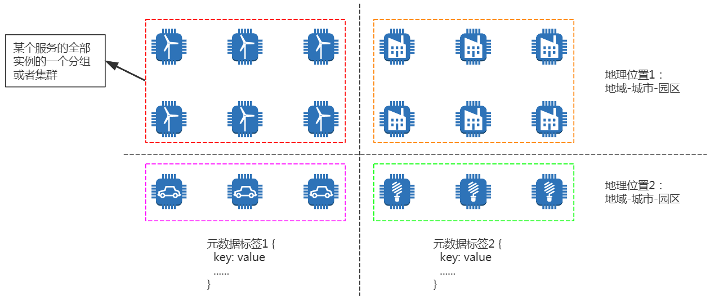

## 动态路由功能定义

通常一个服务包含多个实例。在简单场景下，每个实例是对等的，通过负载均衡组件访问任意一个即可。

但是，在绝大部分场景下，每个实例具有逻辑属性和物理属性：

- 逻辑属性：版本、协议、业务Set、特性环境等。北极星允许用户为每个实例设置自定义标签
- 物理属性：地理位置。比如实例所属的地域-城市-园区的位置信息。

对于某个服务的全部实例，可以根据逻辑和物理属性将其划分成为多个分组或者集群，如下图所示：

服务主调方/消费者发送请求，**动态路由组件**根据请求和主调方节点属性，将不同节点的不同请求路由到不同实例分组或者集群。

## 串联式路由插件

北极星动态路由组件采用插件化、可配置的方式实现。北极星默认内置以下路由插件：

- 前置路由插件：默认在插件链的最前面执行，用于剔除隔离和权重为0的实例。
- 规则路由插件：按照控制台配置的路由规则，根据用户请求参数执行路由规则进行服务实例的过滤。
- 元数据路由插件：直接根据传入的实例元数据对服务实例进行过滤。
- 就近路由插件：根据应用自身所属的地域信息，与实例的地域信息进行匹配，筛选出就近的服务实例。
- 后置路由插件：剔除健康状态异常和故障熔断的实例。如果被剔除的节点数超过一定比例，返回前一个插件的筛选结果，防止因网络分区原因导致的误剔除。

当调用GetOneInstance接口时，会调用路由插件，执行动态路由进行实例筛选，执行流程如下图所示：

插件链中路由插件的执行顺序可以由用户自行编排，同时用户也可以定制自己的路由插件。

