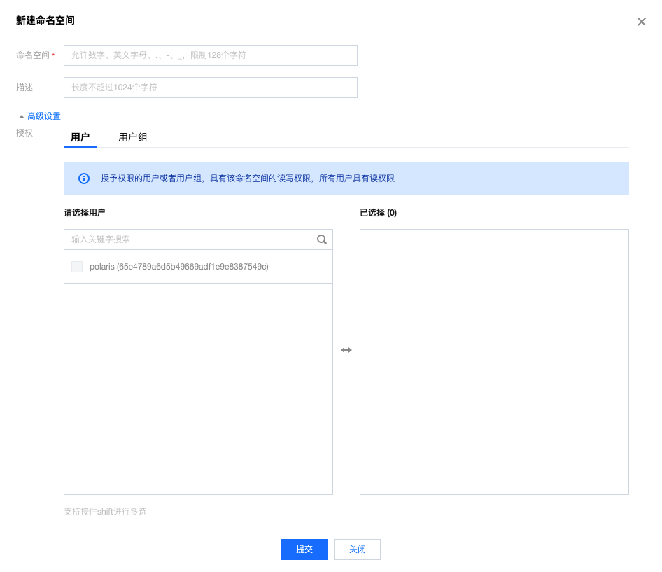
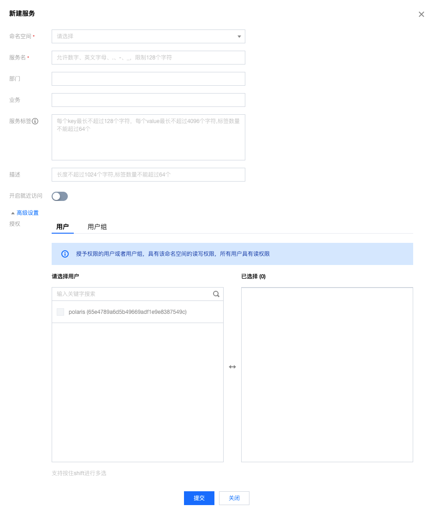

# 使用控制台

- [使用控制台](#使用控制台)
  - [服务端开启鉴权](#服务端开启鉴权)
  - [如何创建鉴权策略](#如何创建鉴权策略)
  - [新建资源如何选择可操作用户](#新建资源如何选择可操作用户)
    - [创建命名空间](#创建命名空间)
    - [创建服务](#创建服务)

---

## 服务端开启鉴权

1. 参考安装步骤：[集群安装](https://polarismesh.cn/zh/doc/%E5%BF%AB%E9%80%9F%E5%85%A5%E9%97%A8/%E5%AE%89%E8%A3%85%E6%9C%8D%E5%8A%A1%E7%AB%AF/%E5%AE%89%E8%A3%85%E9%9B%86%E7%BE%A4%E7%89%88.html#%E9%9B%86%E7%BE%A4%E7%89%88%E5%AE%89%E8%A3%85)
2. 参考示例`polaris-server.yaml`

        ```yaml
        auth:
        # 鉴权插件
        name: defaultAuth
        option:
          # token 加密的 salt，鉴权解析 token 时需要依靠这个 salt 去解密 token 的信息
          # salt 的长度需要满足以下任意一个：len(salt) in [16, 24, 32]
          # 如有自定义需求，需要在首次部署时指定
          salt: polarismesh@2021
          # 控制台鉴权能力开关，默认开启
          consoleOpen: true
          # 客户端鉴权能力开关, 默认关闭
          clientOpen: false
        ```

    - 若为VM部署，修改每个**polaris**部署节点中的`polaris-server.yaml`文件，修改完后执行以下命令进行重启**polaris**
      - Linux 或者 MacOS 机器
      ```shell
      bash tool/stop.sh
      bash tool/start.sh
      ```
      - Window 机器
      ```shell
      bash tool/stop.cmd
      bash tool/start.cmd
      ```
    - 若为容器化部署，则先修改名称为`polaris-server-config`的configmap，修改完之后，执行以下命令触发**polaris**的滚动重启
      ```shell
      kubectl rollout restart statefulset polaris
      ```


    - 如果有修改 salt 的需要，则需要按照以下步骤执行
      - 确定最终的 salt 值并将其修改至`polaris-server.yaml`中
      - 执行**auth/defaultauth/token_test.go**中的`Test_CustomDesignSalt`函数，生成新的`token`
      - 执行下列SQL
        ```sql
        INSERT INTO
            `user` (
                `id`,
                `name`,
                `password`,
                `source`,
                `token`,
                `token_enable`,
                `user_type`,
                `comment`,
                `owner`
            )
        VALUES
            (
                '65e4789a6d5b49669adf1e9e8387549c',
                'polaris',
                '$2a$10$5XMjs.oqo4PnpbTGy9dQqewL4eb4yoA7b/6ZKL33IPhFyIxzj4lRy',
                'Polaris',
                '${新的token}',
                1,
                20,
                'default polaris admin account',
                ''
            );
        ```
      - 这样就完成了主账户的`token`变更

## 如何创建鉴权策略

- 单击新建策略。填写策略基本信息，在角色栏可以选择需要授权用户或用户组，单击下一步选择授权的资源。
  
- 在资源栏可选择北极星的资源类型，包括命名空间、服务等资源，主账号可对所有资源进行操作。
  
- 单击下一步，进入预览界面，详细展示该策略涉及的用户、用户组以及资源。确认信息无误后，单击完成。
  
- 主账号可在权限策略列表查阅现有的权限策略，可单击编辑进行授权或删除等操作。
  


## 新建资源如何选择可操作用户

### 创建命名空间

- 在命名空间页面中，点击新建，在弹出页面中，点击高级选择可以操作本资源的用户或者用户组
  

### 创建服务

- 在服务列表页面中，点击新建，在弹出页面中，点击高级选择可以操作本资源的用户或者用户组
  
